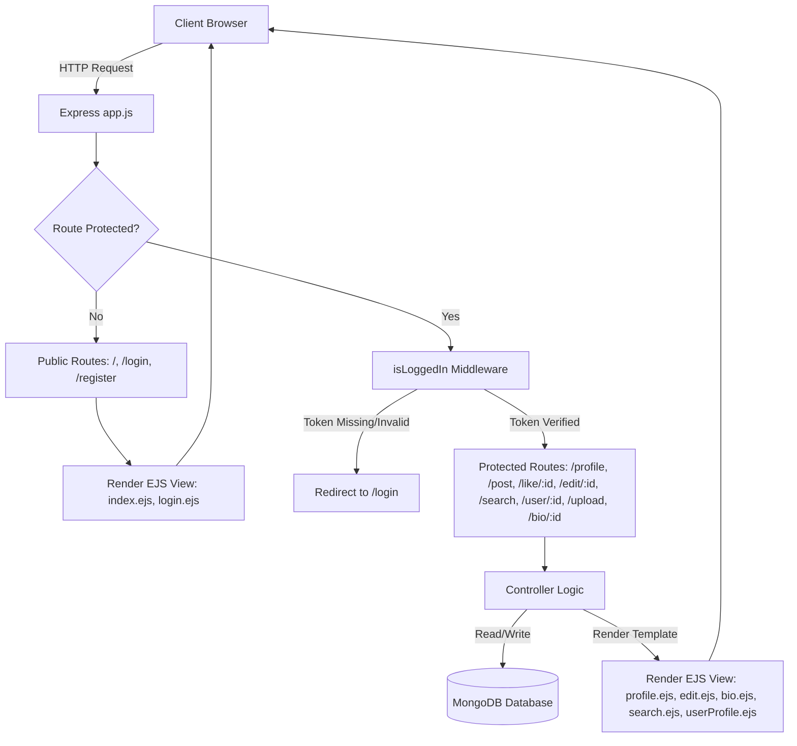

# 🌐 Social Sphere SSR

A highly responsive, **Server-Side Rendered (SSR) social networking application** built with the Node.js ecosystem. This platform emphasizes secure session handling, relational-style document referencing, and dynamic server-side templating to deliver a seamless social media experience.

---

### 🛠️ Tech Stack & Integrations

<p align="left">
  
  
  
  
  
  
  
  
  
</p>

---

## 📋 Table of Contents
- [📖 Project Overview](#-project-overview)
- [⚙️ System Architecture & Flow](#️-system-architecture--flow)
- [🚀 Features](#-features)
- [📂 Project Directory Structure](#-project-directory-structure)
- [🗄️ Database Schemas](#️-database-schemas)
- [🔌 API Endpoints & Routes](#-api-endpoints--routes)
- [⚙️ Installation & Configuration](#️-installation--configuration)
- [🔒 Security Implementations](#-security-implementations)
- [💡 Code Review & Optimization Insights](#-code-review--optimization-insights)
- [📌 Future Enhancements](#-future-enhancements)

---

## 📖 Project Overview

**Social Sphere SSR** is designed to demonstrate full-stack engineering fundamentals using a monolithic, server-side rendered model. By combining **Express.js** as the application layer with **MongoDB/Mongoose** as the data persistence tier, it implements clean CRUD operations, dynamic views via **EJS**, and utility-first styling with **Tailwind CSS**. 

The application implements stateful authentication using JSON Web Tokens (JWT) stored in HTTP-Only cookies, ensuring that only logged-in users can interact with profiles, upload profile images, publish posts, search the directory, and like other users' content.

---

## ⚙️ System Architecture & Flow

The lifecycle of a typical client request through the application runs through the routing, middleware verification, and controller-to-database integration flow described below:



---

## 🚀 Features

### 🔐 Authentication & Session Security
* **Secure Registration & Logins**: Registration inputs are evaluated, passwords hashed with `bcrypt`, and user accounts initialized with defaults.
* **Cookie-Based JWT Session Management**: Instead of memory-heavy server sessions, users receive a signed JWT cookie (`token`) upon logging in, enabling stateless but secure requests.
* **Route Protection Middleware**: A custom `isLoggedIn` middleware prevents unauthorized clients from accessing private views or making data mutations.

### 📝 Post & Interaction Engine (CRUD)
* **Creation & Deletion**: Users can write short text posts which dynamically link back to their profile.
* **Editing Capabilities**: Users can modify their existing posts through dedicated forms.
* **Interactive Engagement**: An optimized liking mechanism toggles user like markers on posts asynchronously or synchronously.

### 👤 Profile Customization & Personalization
* **Avatar Uploads**: Integrates **Multer** to handle multipart image uploads, writing static files securely to local storage.
* **Bio Management**: Users can publish or edit a bio to personalize their profiles.

### 🔍 Discovery & Networking
* **Global User Search**: Uses MongoDB regular expression queries to match input keywords against users' usernames and names.
* **Public Profile Directory**: Users can visit other members' profile pages, read their bios, and interact with their published posts.

---

## 📂 Project Directory Structure

```directory
Social-sphere-ssr/
├── config/
│   └── multerconfig.js      # Multer disk-storage engine setup for user avatars
├── models/
│   ├── post.js              # Mongoose Post model structure & relationships
│   └── user.js              # Mongoose User model structure & local DB connection
├── public/                  # Static assets folder (Gitignored, created on demand)
│   └── images/
│       └── uploads/         # Destination directory for uploaded avatar images
├── views/                   # Server-side EJS UI template files
│   ├── bio.ejs              # Edit bio modal/page
│   ├── edit.ejs             # Post edit view
│   ├── index.ejs            # Landing / Registration page
│   ├── login.ejs            # User login page
│   ├── profile.ejs          # Logged-in user dashboard
│   ├── search.ejs           # Directory search interface
│   ├── test.ejs             # Orphaned picture-upload form view (Dev stage)
│   └── userProfile.ejs      # View page for other users' profiles
├── .gitignore               # Excludes .env, node_modules, and public assets
├── app.js                   # Root server script, middleware config, and route mappings
├── package.json             # NPM project description, metadata, and dependencies
└── README.md                # Project documentation
```

---

## 🗄️ Database Schemas

The application implements a relational document structure utilizing Mongoose's `ObjectId` reference model.

### 1. User Schema (`models/user.js`)
```javascript
const userSchema = mongoose.Schema({
    username: String,
    name: String,
    age: Number,
    email: String,
    password: String, // Stored as Bcrypt Hash
    profilepic: {
        type: String,
        default: "default.png"
    },
    posts: [
        {
            type: mongoose.Schema.Types.ObjectId,
            ref: "post"
        }
    ],
    bioContent: {
        type: String, 
        default: ""
    }
});
```

### 2. Post Schema (`models/post.js`)
```javascript
const postSchema = mongoose.Schema({
    user: {
        type: mongoose.Schema.Types.ObjectId,
        ref: "user"
    },
    date: {
        type: Date,
        default: Date.now()
    },
    content: String,
    likes: [
        {
            type: mongoose.Schema.Types.ObjectId,
            ref: "user"
        }
    ],
    bio: Boolean
});
```

---

## 🔌 API Endpoints & Routes

| HTTP Method | Route | Description | Auth Required | View Rendered |
|---|---|---|:---:|---|
| **GET** | `/` | Home Page / Sign-up Form | No | `index.ejs` |
| **POST** | `/register` | Register New User & Issue Token | No | *Redirects to `/profile`* |
| **GET** | `/login` | User Login Page | No | `login.ejs` |
| **POST** | `/login` | Authenticate User & Issue Token | No | *Redirects to `/profile`* |
| **GET** | `/logout` | Clear JWT Cookie & End Session | No | *Redirects to `/login`* |
| **GET** | `/profile` | Profile Dashboard & Own Posts | **Yes** | `profile.ejs` |
| **POST** | `/post` | Create a New Text Post | **Yes** | *Redirects to `/profile`* |
| **GET** | `/like/:id` | Toggle Post Like | **Yes** | *Redirects to `/profile`* |
| **GET** | `/edit/:id` | Edit Post Form | **Yes** | `edit.ejs` |
| **POST** | `/update/:id` | Update Post Content | **Yes** | *Redirects to `/profile`* |
| **GET** | `/delete/:id` | Delete Post | **Yes** | *Redirects to `/profile`* |
| **POST** | `/upload` | Handle Profile Picture Upload | **Yes** | *Redirects to `/profile`* |
| **GET** | `/bio/:id` | Edit User Bio Form | **Yes** | `bio.ejs` |
| **POST** | `/update/bio/:id`| Update User Bio | **Yes** | *Redirects to `/profile`* |
| **GET** | `/search` | Find Users by Username/Name | **Yes** | `search.ejs` |
| **GET** | `/user/:id` | View Another User's Profile | **Yes** | `userProfile.ejs` |

---

## ⚙️ Installation & Configuration

### Prerequisites
- [Node.js](https://nodejs.org/) (v16+ recommended)
- [MongoDB](https://www.mongodb.com/) running locally or a MongoDB Atlas connection URI.

### 1. Clone & Install Dependencies
```bash
git clone https://github.com/your-username/social-sphere-ssr.git
cd social-sphere-ssr
npm install
```

### 2. Configure Environment Variables
Create a `.env` file in the root directory:
```env
PORT=YOUR_PORT_HERE
JWT_SECRET=your_jwt_signing_key_here
```

### 3. Create Upload Directories
Since the uploaded profile images directory is ignored by Git, you must create it locally before starting the server to prevent upload failures:
```bash
mkdir -p public/images/uploads
```

### 4. Run the Application
Start the Node.js server:
```bash
node app.js
```
The application will be accessible at: `http://localhost:3002`

---

## 🔒 Security Implementations

* **Password Cryptography**: Salted (10 rounds) passwords hashing using `bcrypt` prevents plain-text exposure in databases.
* **Stateless Authenticated Requests**: Requests retrieve JWTs from HTTP-only cookies, reducing cross-site scripting (XSS) exploit vectors.
* **Encapsulated Env Configuration**: Key parameters (JWT Secret, Server Port) are completely abstracted out of source code.
* **Route Guards**: Critical actions like deleting, editing, liking, uploading, and querying data are gated behind active token checks.

---


## 📌 Future Enhancements

- **Real-Time Interactive Elements**: Integrate Socket.io for immediate like counter updates and notification deliveries.
- **Relational Networking**: Establish a `Follower` / `Following` join relationship model.
- **Enhanced Cloud Media Storage**: Migrate local Multer uploads to AWS S3 or Cloudinary for scalable file management.
- **Separation of Concerns**: Refactor backend routes to return RESTful JSON responses and pair them with a Single Page Application (SPA) frontend like React or Vue.
